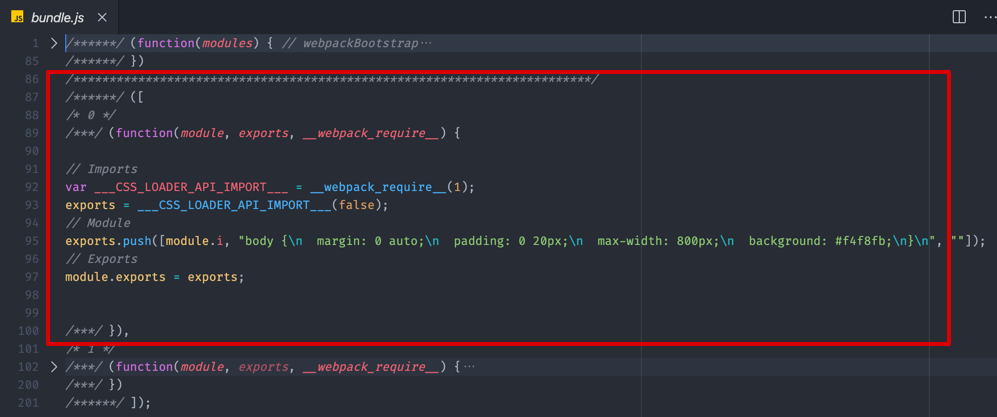

# 学习 webpack

前端模块化打包工具

## webpack 的常用属性

- entry：打包的入口，可以是多个
- output：输出配置，只能是一个
- loader：核心编译
- plugin：扩展
- devServer：开发服务器

## entry 入口

- 文件的打包入口 可以有多个入口。

- css、js 都可以作为打包入口，一般情况下是 js（main.js）

```javascript
// webpack.config.js  
module.exports = {
  entry: './src/main.js',
}
```

- 多个入口打包

```javascript
// webpack.config.js  
module.exports = {
  entry: ['./src/file_1.js', './src/file_2.js'],
}
```

## output 输出

> 可以通过配置 output 选项，告知 webpack 如何向硬盘写入编译文件。注意，即使可以存在多个 entry 起点，但只能指定一个 output 配置。

```javascript
const path = require('path')

module.exports = {
  // 文件的打包入口 可以有多个入口
  entry: './src/main.js',  // 注意这里的 ./ 不能省略
  // 只能存在一个 输出
  output: {
    // 输出文件的名称
    filename: '03-bundle.js',
    // 输出的文件的路径名称
    path: path.join(__dirname, 'dist')
  },
}
```

### outpu.publicPath

配置项目的公共路径 一般是cnd路径

```javascript
module.exports = {
  // 文件的打包入口 可以有多个入口
  entry: './src/main.js',  // 注意这里的 ./ 不能省略
  // 只能存在一个 输出
  output: {
    // 输出文件的名称
    filename: '03-bundle.js',
    // 输出的文件的路径名称
    path: path.join(__dirname, 'dist'),
    // 项目的公共路径 
    publicPath: '/CDN/apps'
  },
}
```

也可以在入口文件中通过 `__webpack_public_path__` 动态配置 (微前端中配置过)

```javascript
__webpack_public_path__ = myRuntimePublicPath;
```

## Loader

> loader 的作用很简单，就是处理任意的文件，并将它们转换成一个 webpack 可以处理的模块

- webpack 内部默认只能处理，js 模块代码，在打包过程中，它默认把所有遇到的文件当作 js 代码来解析
- webpack 是使用 loader 来处理每个模块的，而内部的 loader 只能处理 js 模块，如果需要其他模块学院配置不同的 loader


### 关于配置loader的方式有三种：

- 配置方式（推荐）：在 webpack.config.js文件中指定 loader
- 内联方式：在每个 import 语句中显式指定 loader
- CLI 方式：在 shell 命令中指定它们

### loader 使用方式

在 module 中添加一个 rules 数组，这个数组就是针对资源模块的加载规则配置

每个规则中都要设置两个属性：

- test 属性：它是一个正则表达式，用来匹配打包过程遇到的文件路径
- use 属性：它用来中的指定文件使用的 loader

```javascript
const path = require('path')

module.exports = {
  mode: 'none',
  entry: './src/main.js',
  output: {
    filename: '03-bundle.js',
    path: path.join(__dirname, 'dist')
  },
  module: {
    rules: [
      {
        // 正则表达式，来匹配文件
        test: /\.css$/,
        //  指定具体的 loader
        use: [
          'css-loader'
        ]
      }
    ]
  }
}
```

这样 css 文件就会交给 css-loader 处理后再有 webpack 打包

`css 文件` ==> `css-loader` ==> `webpack` ==> `bundle.js`


#### 样式加载失败

css-loader 只是把 css 编译成 一段 css 字符串模块，只会把css模块加载到js中，而并不会使用这个模块



- 使用 style-loader 把 css-loader 转换的结果通过 style 标签添加到页面上

- 多个 loader 的执行顺序，从后往前执行

```javascript
const path = require('path')

module.exports = {
  // 打包模式
  mode: 'none',
  // 文件的打包入口 可以有多个入口
  entry: './src/main.js',  // 注意这里的 ./ 不能省略
  // 只能存在一个 输出
  output: {
    filename: '03-bundle.js',
    // 输出的文件名称
    path: path.join(__dirname, 'dist')
  },
  module: {
    rules: [
      {
        // 正则表达式，来匹配文件
        test: /\.css$/,
        //  指定具体的 loader
        // 多个 loader 的执行顺序，从后往前执行
        use: [
          'style-loader',
          'css-loader'
        ]
      }
    ]
  }
}
```

### 常用的 loader

- file-loader：将一个文件中的 import/require() 解析为 url，并且将文件发送到输出文件夹
- url-loader：用于将文件转换为 base64 URI 的 loader。
- babel-loader：编译 js 文件
- css-loader：处理 css 文件，并对 @import 和 url() 进行处理
- style-loader：把 CSS 插入到 DOM 中
- eslint-loader：lint 检查
- vue-loader：处理 .vue 文件

### loader 的工作流程

- loader 都需要导出一个函数
- loader 接收源文件的内容字符串或者 buffer
- webpack 为 loader 提供上下文，有一些 api 可以使用

简单的工作流程：

1. webpack.config.js 配置一个 js-loader
2. 打包遇到 js 文件，执行 js-loader
3. js-loader 是一个函数，接收来文件的 source
4. js-loader 可以使用一些方法对 source 进行处理，得到结果 result
5. 将 result 返回或者传递给下一个 loader ，**最后结果必须是一段标准的 JS 代码字符串。**

Webpack 加载资源文件的过程类似于一个工作管道，你可以在这个过程中依次使用多个 Loader，但是最终这个管道结束过后的结果必须是一段标准的 JS 代码字符串。

### 手写一个 loader

开发 markdown 加载器，作用 markdown 转 html 在呈现到页面上


1. 开发 markdown-loader

```javascript
// markdown-loader.js

// 引入 marked 模块（node 模块）
const marked = require('marked')

module.exports = source => {
  // 加载到文件到模块内容
  console.log('source:', source)

  //  1. 将 markdown 转换为 html 字符串
  const html = marked(source)

  // 2. 将 html 字符串拼接为一段导出字符串的 JS 代码 
  // const code = `module.exports = ${JSON.stringify(html)}`
  const code = `export default ${ JSON.stringify(html) }`

  return code
}
```

webpack 也可以通过 ES Modules 的方式导出，webppack 内部会自己转换

2. 使用

在 module.rules 使用 就可以了

```javascript
// ./webpack.config.js
module.exports = {
  entry: './src/main.js',
  output: {
    filename: 'bundle.js',
  },
  module: {
    rules: [
      {
        test: /\.md$/,
        use: [
          './markdown-loader'
        ]
      }
    ]
  }
}
```

- 也可以多个 loader 配合使用

```javascript
// markdown-loader.js

// 引入 marked 模块（node 模块）
const marked = require('marked')

module.exports = source => {
  // 加载到文件到模块内容
  console.log('source:', source)

  //  1. 将 markdown 转换为 html 字符串
  const html = marked(source)

  // 2. 返回处理后的结果
  return html
}
```

- 引入 html-loader 处理

```javascript
// ./webpack.config.js

module.exports = {
  entry: './src/main.js',
  output: {
    filename: 'bundle.js',
  },
  module: {
    rules: [
      {
        test: /\.md$/,
        use: [
          'html-loader',
          './markdown-loader'
        ]
      }
    ]
  }
}
```

## plugin

- webpake 插件机制的目的是为了增强 webpack 在项目自动化构建方面的能力
- loader 是负责完成项目中各种各样的资源模块加载，从而实现整体项目模块化
- plugin 是解决项目除了资源模块打包以外的自动化工作，plugin 能力范围更广、用途也更多

常用的插件场景：

- 实现自动在打包之前清除 dist 目录（上次打包的结果）
- 自动生成应用所要的 html 文件
- 根据环境不同为代码注入API地址这种可能变化的部分
- 拷贝不需要参与打包的资源文件到输出目录
- 压缩 webpack 打包完后输出的文件
- 自动发布打包结果到服务器实现自动部署

### 自动清理上次打包的结果 （CleanWebpackPlugin）

```javascript
const { CleanWebpackPlugin } = require('clean-webpack-plugin')

module.exports = {
  entry: './src/main.js',
  output: {
    filename: 'bundle.js'
  },
  plugins: [
    new CleanWebpackPlugin()
  ]
}
```

### 用于生成 HTML 插件 html-webpack-plugin

相比于之前写死 HTML 文件的方式，自动生成 HTML 的优势在于：

- html 也输出到 dist 目录中，上线只需要把 dist 目录发布出去就行
- HTML 中的 script 标签是自动引入的，所以可以确保资源文件的路径是正常的。
- 可以动态生成 模版 以及模版里面 title、 meta标签的信息

```javascript

const HtmlWebpackPlugin = require('html-webpack-plugin')
const { CleanWebpackPlugin } = require('clean-webpack-plugin')

module.exports = {
  entry: './src/main.js',
  output: {
    filename: 'bundle.js'
  },
  plugins: [
    new CleanWebpackPlugin(),
    new HtmlWebpackPlugin({
      title: 'Webpack Plugin Sample',
      template: './src/index.html'
    })
  ]
}
```

### 用于复制文件的插件 copy-webpack-plugin

不需要参与构建的静态文件，复制到输出目录下面

图片、icon 拷贝到 static 或者 public 下面

```javascript
// ./webpack.config.js

const HtmlWebpackPlugin = require('html-webpack-plugin')
const CopyWebpackPlugin = require('copy-webpack-plugin')
const { CleanWebpackPlugin } = require('clean-webpack-plugin')

module.exports = {
  entry: './src/main.js',
  output: {
    filename: 'bundle.js'
  },
  plugins: [
    new CleanWebpackPlugin(),
    new HtmlWebpackPlugin({
      title: 'Webpack Plugin Sample',
      template: './src/index.html'
    }),
    // 复制文件
    new CopyWebpackPlugin({
      patterns: [
        {
          from: 'public', to: 'public'
        },
      ]
    })
  ]
}
```

### 手写一个 插件

1. webpack 的插件机制就是我日常软件开发的钩子机制

2. 在 webpack 整个工作过程会有很多环节，为了插件的扩展，webpack在每一个环节都提供钩子函数回调。

3. 这样我们在开发插件时候，通过不同的节点上挂在不同任务就可以了


- webpack 要求我们插件必须是一个函数，或者一个包含 apply 方法的对象。
- webpack 启动的时候会调用这个函数，这个函数会接受一个 compiler 的对象参数
- compiler 参数是 webpack 构建过程最核心的对象，这个对象可以使用

1. compiler 对象

```javascript
// 手写插件
class RemoveCommentsPlugin {
  apply(compiler) {
    // compiler => 包含了我们此次构建的所有配置信息
    console.log('RemoveCommentsPlugin 启动')
  }
}
```

2. 通过 compiler 对象的 hooks 属性访问 emit 钩子，在通过tap方法注册一个钩子函数

这个方法接受2个参数

- 插件的名字
- 挂载到钩子上函数，函数可以接收一个 compilation 参数，这个参数是此次允许打包的上下文

简单流程

1. 通过 compilation.assets 属性回去资源文件信息，它是一个对象，其中对象的 key 是每一个文件的名称
2. for in 遍历获取每个文件对象的 source 方法
3. 判断是否是 js 文件，如果是 js 文件，就处理文本内容，生成新的文本内容（处理注释）
4. 暴露一个新的 source 方法来返回新文本内容，和一个 size方法，用来返回内容的大小
5. 最后覆盖掉 compilation.assets[key] 对应的属性，webpack 内部要求的格式

```js
class RemoveCommentsPlugin {
  apply(compiler) {
    compiler.hooks.emit.tap('RemoveCommentsPlugin', compilation => {
      // compilation => 可以理解为此次打包的上下文
      for (const name in compilation.assets) {
        // compilation[name]
      }
    })
  }
}
```

## webpack 打包流程工作原理

1. Webpack CLI 启动打包流程；
2. 载入 Webpack 核心模块，创建 Compiler（康派来儿） 对象；
3. 使用 Compiler 对象开始编译整个项目；
4. 从入口文件开始，解析模块依赖，形成依赖关系树；
5. 递归依赖树，将每个模块交给对应的 Loader 处理；
6. 合并 Loader 处理完的结果，将打包结果输出到 dist 目录。

## webpack 工作流程

1. 参数解析
2. 找到入口文件
3. 调用 Loader 编译文件
4. 遍历 AST，收集依赖
5. 生成 Chunk
6. 输出文件

## 打包加速的方法

- 多线程编译，加快编译速度：thread-loader（四软特）、happypack
- 第三方依赖外链 script 引入：vue、ui组件、JQuery等
- Tree Shaking（谁给ing）摇树：基于es6 提供的模块系统，对代码惊喜静态分析， 并在压缩阶段将代码中死代码（dead code）移除，减少代码体积

## webpack 常用的插件

- TerserPlugin（特si）（老版本用UglifyJsPlugin）：压缩代码，删除 log 日志
- CopyWebpackPlugin：复制文件，dist 目录下 复制到 /nginx/dist/ 目录
- webpack-bundle-analyzer（ban dou）（安的来ze儿）：webpack打包出来的各个文件体积大小，以便我们定位大文件，进行体积优化
- DefinePlugin：定义全局变量。项目环境下 修改 process.env，添加项目ID
- HotModuleReplacementPlugin：页面热更新插件

## 常用的 loader

- babel-loader：转换es6语法，打补丁
- style-loader：将所有的计算后的样式加入页面中，二者组合在一起使你能够把样式表嵌入webpack打包后的js文件中
- css-loader：加载 import 进来的css

## webpack 性能优化

- 打包分析：使用 `webpack-bundle-analyzer` 插件
- 缩小文件的搜索范围
    - `resolve.extension`（扩展）：它告诉 webpack 当我们在导入模块，**但没有写模块的后缀**时应该如果去查找模块。
    - `resolve.mainFileds`：它告诉 webpack 当我们导入模块，**但没有写模块的具体名字时**，应该如何查找这个模块
    - `resolve.alias`（别名）：当我们有一些不得引用的第三方库或模版的时候，可以通过设置别名，直接引入它的 `.min.js` 文件，执行可以在库内的直接解析
    - Loader 使用`include`、`exclude`、`test` 属性 来配合 loader 进行限制文件的搜索范围
- Tree Shaking去掉冗余的代码
- DllPlugin减少第三方库的编译次数
- HappyPack并行构建优化

[Webpack 构建速度优化](https://www.cxyzjd.com/article/sinat_17775997/88716768)

[Webpack性能优化](https://wangtunan.github.io/blog/webpack/webpack/optimization.html#%E6%89%93%E5%8C%85%E5%88%86%E6%9E%90)

### 打包分析

打包分析
::: tip 提示

webpack 性能优化之前，可以通过 `webpack-bundle-analyzer` 插件，知道每个包的文件大小，打包的时间多少，这些对我们进行性能优化很有帮助
:::

安装：

```shell
npm install webpack-bundle-analyzer --save-dev
```

webpack.prod.js 使用这个插件：

```js
const BundleAnalyzerPlugin = require('webpack-bundle-analyzer').BundleAnalyzerPlugin;
const prodConfig = {
  // 其它配置项
  mode: 'production',
  plugins: [
    new BundleAnalyzerPlugin()
  ]
}
```

配置完毕后，运行npm run build命令来查看打包分析结果，会在浏览器提供一个静态的页面

### 缩小文件的搜索范围

:::tip

webpack 的一个配置参数 `Resolve` 的作用：它告诉 webpack 怎么去搜索文件。

- `resolve.extension`（扩展）：它告诉 webpack 当我们在导入模块，**但没有写模块的后缀**时应该如果去查找模块。
- `resolve.mainFileds`：它告诉 webpack 当我们导入模块，**但没有写模块的具体名字时**，应该如何查找这个模块
- `resolve.alias`（别名）：当我们有一些不得引用的第三方库或模版的时候，可以通过设置别名，直接引入它的 `.min.js` 文件，执行可以在库内的直接解析
- Loader 使用`include`、`exclude`、`test` 属性 来配合 loader 进行限制文件的搜索范围
  :::

**1、优化 loader 配置**

Loader 处理文件的转换操作是很耗时的，所以需要让尽可能少的文件被 Loader 处理

`include`、`exclude`、`test` 来配合loader 进行限制文件的搜索范围

`babel-loader?cacheDirectory`：开启转换结果缓存

```js{7,9,10}
module.exports = {
  module: {
    rules: [
      {
        test: /\.js$/,
        use: [
          'babel-loader?cacheDirectory',  // 开启转换结果缓存
        ],
        include: path.resolve(__dirname, 'src'),    // 只对src目录中文件采用babel-loader
        exclude: path.resolve(__dirname, ' ./node_modules'),    // 排除node_modules目录下的文件
      },
    ]
  }
}
```

**2、优化 resolve.modules 配置**

`resolve.modules` 用于配置 webpack 去那先目录下查处第三方的依赖

默认为：`['node_modules']`， 但是它会先当前目录的 `./node_modules`查找

如果没有的话再去 `../node_modules` 最后到根目录

解决：安装的第三方依赖都在当前目录下，就没有必要一层一层的往上查找，直接明确明确存放的绝对位置

```js
module.exports = {
  resolve: {
    modules: [path.resolve(__dirname, 'node_modules')]
  }
}
```

**3、优化 resolve.extension 配置**

`extensions （扩展）` 它告诉了 Webpack 当我们在导入模块，但没有写模块的后缀时，应该如何去查找模块。

默认为 extensions: `['js','json']`;

- 当遇到 `require('./data')` 时 webpack 会尝试寻找data.js，没有找到再去找 data.json； 如果列表越长，或者正确的后缀越往后，尝试的次数就越多
- 提升构建优化需要最守
    - 频率出现高的文件后缀优先放在前面
    - 列表尽可能小
    - 书写导入语句时，尽量写上后缀

### 使用 DllPlugin 优化

DllPlugin减少第三方库的编译次数

### 使用 HappyPack 并行构建优化

核心原理：将 webpack 中最耗时的loader 文件转换操作任务，分解到多个进程并行处理，从而减少构建


