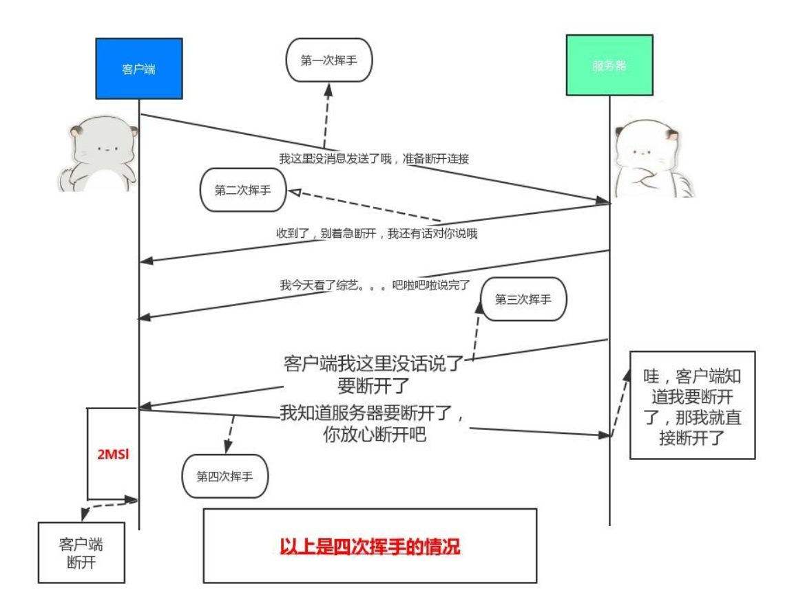

# http 相关面试题

## http、https 区别
- http：IP => TCP => HTTP(应用层)
- https：IP => TCP => SSL => HTTP(应用层)
- http 是明文传输数据，不安全，https 在http的基础上 使用了 ssl协议进行了加密处理，比较安全
- http 页面响应速度比 https较快，https多了 ssl 握手的过程，也就是对数据加密的过程
- http 默认端口是80，https 是 443

## http1.0、http2.0 的区别

- http2.0 多路复用，多个请求都在同一个tcp上连接，http1.0 请求数据要多次连接tcp
- 相对于 http1.0，2.0 多了对消息头的压缩，减少了传输数据的大小
- 2.0 采用二进制格式传输数据，1.0是文本格式，二进制协议解析起来更高效

## http 缓存
ctrl + f5 强制刷新网页时，直接从服务器加载，跳过强缓存和协商缓存

f5 刷新页面时候，跳过强缓存，但是会检测协商缓存

**强缓存**
- expire（有效期）
设置一个缓存过期的时间（值为GMT时间），具体到年月日秒，在这个时间内，则直接使用缓存数据
    - 浏览器时间和服务器时间不同步
    - 缓存过期后，不管文件有木有变化，服务器都会再次读取文件返回浏览器
    - http1.0的东西，现在默认是1.1了，它的作用基本忽略
- cache-control：
    - no-cache：不使用本地缓存，走协商缓存
    - no-store：禁止浏览器缓存数据
    - public：内容可被缓存到到客户代理服务器
    - private：内容仅能被缓存到客户端本地
    
**协商缓存**
- last-modified 

##  http 安全
[参考](https://github.com/dwqs/blog/issues/68)
#### XSS 跨站脚本攻击
恶意将代码注入到客户端攻击
- 攻击模式：
    - 基于 DOM：恶意修改页面的 dom 结构，是纯粹的客户端攻击
    - 存储型：例如写文章的平台，用户恶意写了一段js代码，保存文章，那么以后打开这篇文章的人都会遭到恶意代码的攻击
    - 反射型：诱导用户点击恶意连接，用户点击后注入恶意脚本到客户端

- 预防：
    - 给 cookie 设置 `httpOnly` ，禁止 js 脚本访问 cookie
    - 输入检查，不要相信用户输入的内容，对输入的内容进行必要的过滤、转义，例如vue源码里面 decodingMap 对输入内容转换，转义
    - 输出检查，客户端拿到数据时候，有些渲染也要进行必要过滤、转义，vue 的 v-html，

#### CSRF 跨站请求伪造

一种劫持受信任用户向服务器发送非预期请求的方式

通常情况 CSRF 攻击是借助受害者的 cookie 骗取服务器的信任来进行一些操作

- 预防：
    - 服务端添加 Referer 判断
    - token 验证，服务器生成token，前端请求的时候添加token，服务器校验token 是否正确

## http 状态码 todo

- 2XX：成功状态码
    - 200：服务器接收并处理成功
- 3XX：重定向
    - 301：请求的资源被永久重定向
    - 304：服务器回应客户端请求，告诉客户端本地缓存可用
- 4XX：客户端错误
    - 400：客户端请求语法错误（请求参数错误）
    - 401：请求未授权，需要认证用户的身份
    - 403：没有权限访问
    - 404：访问的资源不存在
- 5XX：服务端错误
    - 500：服务器内部错误
    - 503：服务器端暂时无法处理请求（可能是过载或维护）
    - **506：todo**

## https 请求过程（ssl握手）
1. 客户端请求服务器，拿到公钥

## 浏览器输入后回车的事情

- DNS 解析 url 对应的 ip
- 根据 ip 建立 TCP 连接（三次握手）
- 客户端发送 HTTP 请求
- 服务端处理请求，浏览器接受 http 响应
- 关闭 tcp 连接（四次挥手）
- 浏览器渲染页面，创建渲染树

## 渲染页面的过程以及遇到的问题
**流程：**

1. 浏览器从上到下解析 html 文档，创建 dom 树
2. 解析 css 生成 cssom （css 规则树）
3. 解析完成后，浏览器会根据 dom 树和 css 规则树来构造渲染树（Render Tree）
4. 根据渲染树的节点，布局到屏幕的正确的位置
5. 遍历渲染树所有节点，绘制页面

**浏览器在创建 dom 树过程：**
- 遇到 css 的时候：会异步下载，生成异步的 css 规则树，不会堵塞 dom 树的出构建，但是会影响渲染树的最终生成，
因为渲染树有 dom 树和 css 规则树组成

- 遇到 js的时候：dom 树构建会停止，会先去加载和执行 js 代码，会中断构建 dom 树，
如果这时候 js 操作页面样式，还有可能造成，重绘或回流

**这时候产生的优化问题：**

- css 优化：首屏页面 css 独立出来，放到 style 里面 内行加载

- JS 优化：在页面的最下面引入 js，或者使用 defer 属性，这样页面在渲染会在渲染完成后加载
    - async：异步加载，下载过程中不会影响到 html 的解析，但是下载完成后会立即执行，对堵塞 html 解析
    - defer：异步加载，下载过程中不会形象到 html 的解析，会在所有的元素解析完成后，DOMContentLoaded 事件之前触发完成

## tcp 的三次握手

**三次过程：**

- 客户端：你能收我消息么？
- 服务端：可以的，你能接收到我的回复吗？
- 客户端：可以的，那我们开始聊正事把

1. 为啥是3次：
- 三次是最少的安全次数，两次不安全，四次浪费资源。
- 避免历史链接，确定客户端发的请求是这次通讯的人

2. 为啥不是4次：
- 四次浪费资源

## tcp 协议 四次挥手

TCP是全双工信道，何为全双工就是客户端与服务端建立两条通道：

- 通道1：客户端的输出链接服务端的输入
- 通道2：客户端的输入链接服务端的输出

两个通道可以同时工作：客户端向服务端发送信号的同时服务端也可以向客户端发送信号。

关闭通道：

- 客户端：我要关闭通道了
- 服务端：好的你关闭，我这边也要关闭通道了
- 服务端：我也要关闭通道了
- 客户端：好的，你关闭吧，我也吧这个通道关闭了

1. 为什么不能是两次
    - 无法确认服务端是否能到断开消息，还有服务端可能还有消息未发送完

2. 为什么不能是三次
    - 三次情况服务端接收到断开消息，向客户端发送确认接受消息，客户端未给最后确认断开的回复。

 

## 一个 tcp 连接能发几个 http 请求 todo

todo

## 重绘和回流

**回流：**
> 当render tree中的一部分(或全部)因为元素的规模尺寸，布局，隐藏等改变而需要重新构建。

回流必将引起重绘，而重绘不一定引起回流

1. 尺寸、位置、显示、隐藏 `dispaly:none/block` 发生了改变的时候，导致页面需要重新构建，
2. 添加或删除可见的 dom 元素

**重绘：**

当元素的某些样式，比如背景色、border颜色发生变化时，但不影响页面布局，这就是重绘；

优化方法：

1.给 dom 添加 class，而不是修改样式
2.如果需要对dom进行多次样式修改，也可以先将dom隐藏掉，修改完在显示出来（这样只产生两次回流：显示、隐藏）

