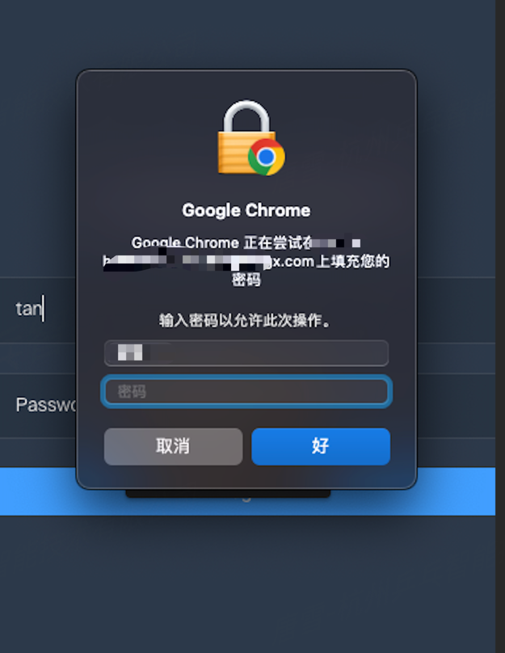

# 关闭 Chrome 密码填充启用生物识别身份验证

## 问题

Chrome 密码自动填充需要 Mac 密码的二次确认，但是我不想用Mac 密码，怎么办？

如图：

## 解决方法

1. 修改 Chrome 的 Biometric authentication reauth before filling
2. `chrome://flags/#biometric-authentication-for-filling` 设置为 `Disabled`
3. 重启 Chrome

相关操作配置：

## 参考

[Chrome新增密码填充调用Windows Hello提高安全性 以下是开启方法](https://www.landiannews.com/archives/95505.html)
