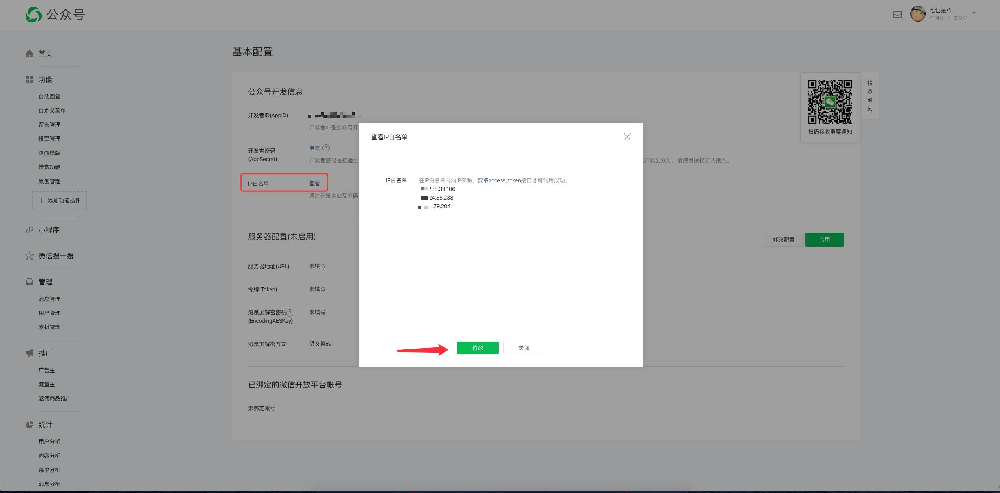

# 微信网页开发

微信授权登录、微信 JS-SDK 配置以及微信支付

::: tip 提示
请认真阅读微信网页开发 [JS-SDK 说明文档](https://developers.weixin.qq.com/doc/offiaccount/OA_Web_Apps/JS-SDK.html)

微信官方文档集合：[文档](https://developers.weixin.qq.com/doc/)
:::

## 准备工作
- 请认真阅读 [微信授权登录](https://developers.weixin.qq.com/doc/offiaccount/OA_Web_Apps/Wechat_webpage_authorization.html)

- 请认真阅读 [微信 JS-SDK 说明文档](https://developers.weixin.qq.com/doc/offiaccount/OA_Web_Apps/Wechat_webpage_authorization.html
)
- 下载 [微信开发者工具](https://developers.weixin.qq.com/miniprogram/dev/devtools/download.html)
- web 调试代理工具（推荐： [Charles](https://www.charlesproxy.com/)）
- 拥有一个 [微信公共号](https://mp.weixin.qq.com/) 的开发者及以上的操作权限

## 微信公众平台

> 登录微信公众平台进入“公众号设置”的“功能设置”里填写“JS接口安全域名”。
>
> 备注：登录后可在“开发者中心”查看对应的接口权限。


### 绑定域名
 
登录微信公众平台：`公众号设置 > 功能设置 > JS 接口安全域名`

这个域名就是你项目的访问域名，如果是多个项目可以配置顶级域名

公众号域名配置：


::: tip 提示
1. 你的域名必须是一个外网可以访问的域名，并确保可以访问 verify 文件 

2. 由于一个自然月内最多可修改并保存三次域名，建议填写一级域名

3. 多个环境可以使用一个域名，域名是和公众号的 `config` 绑定的 (建议配置一个正式的环境域名和其他环境域名）
:::


###  绑定开发者 todo

登录微信公众平台：管理 > 用户管理 > “公众号设置”的“功能设置”里填写“JS接口安全域名”

### 绑定服务端 IP

登录微信公众平台：`开发 > 基本设置 > 公众号开发信息 > IP 白名单 查看`

这里是设置服务端的IP，获取 access_token 

绑定服务端 IP：



### 其他

服务端可能需要到的公众号开发者信息：`AppID、AppSecret` 这写东西都可以在：`开发 > 基本设置 > 公众号开发信息` 里面查看并设置

## 微信 JS-SDK

> 微信JS-SDK是微信公众平台 面向网页开发者提供的基于微信内的网页开发工具包。通过使用微信JS-SDK
，网页开发者可借助微信高效地使用拍照、选图、语音、位置等手机系统的能力，同时可以直接使用微信分享、扫一扫、卡券、支付等微信特有的能力，为微信用户提供更优质的网页体验。
>

[JS-SDK 说明文档](https://developers.weixin.qq.com/doc/offiaccount/OA_Web_Apps/Wechat_webpage_authorization.html)

### 引入 js 文件

> 在需要调用JS接口的页面引入如下JS文件，（支持https）：http://res.wx.qq.com/open/js/jweixin-1.6.0.js
> 如需进一步提升服务稳定性，当上述资源不可访问时，可改访问：http://res2.wx.qq.com/open/js/jweixin-1.6.0.js （支持https）。
>
> 备注：支持使用 AMD/CMD 标准模块加载方法加载

index.html
1
```html
<script src="https://res.wx.qq.com/open/js/jweixin-1.6.0.js"></script>
```
 
 
### 通过config接口注入权限验证配置

> 所有需要使用JS-SDK的页面必须先注入配置信息，
> 否则将无法调用（同一个url仅需调用一次，对于变化url的SPA的web app可在每次url变化时进行调用,目前Android微信客户端不支持pushState的H5新特性，
> 所以使用pushState来实现web app的页面会导致签名失败，此问题会在Android6.2中修复）。


wxConfigMixin.js

```js
export default {
  methods: {
    async wxConfig() {
      // 获取 config 的配置信息
      const res = await axios({
        url: 'wx/getWechatConfig',
        method: 'POST',
        body: {
          // 用来获取签名的 url 后端需要动态获取
          currentUrl: window.location.href,
        },
      })

      // 注意字段的名称，大小写
      const { appId, timestamp, nonceStr, signature } = res
      await wx.config({
        // 是否开启调试
        debug: true,

        // 必填，公众号的唯一标识
        appId,

        // 必填，生成签名的时间戳
        timestamp,

        // 必填，生成签名的随机串
        nonceStr,

        // 必填，签名
        signature,

        // 必填，需要使用的JS接口列表
        jsApiList: ['onMenuShareTimeline', 'onMenuShareAppMessage'],
      })

      // 通过ready接口处理成功验证
      wx.ready(() => {
        // 需要调用的 js API
      })
    },
  },
}
```

签名算法见文末的[附录1](https://developers.weixin.qq.com/doc/offiaccount/OA_Web_Apps/JS-SDK.html#62)，所有JS接口列表见文末的[附录2](https://developers.weixin.qq.com/doc/offiaccount/OA_Web_Apps/JS-SDK.html#63)

### 通过config接口注入权限验证配置


