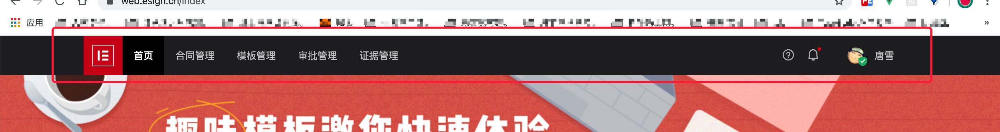

# 标准签 header 模块设计方案

## Header
头部 导航 组件

### Header Attributes


|参数|说明|类型|可选值|默认值|
|---|---|---|---|---|
| logo | logo 的数据 | Object | - | - | 
| nav | 导航的数据 | Array | - | - | 
| account | 帮助中心、站内信、头像及退出功能 | Object | - | - | 

::: details 查看数据结构

```js
export default {
  data() {
    return {
      // logo部分
      logo: {
        // logo 图片的地址，默认 oss 地址 @string
        url: 'xxxx'
      },
      // 导航部分
      nev: [
        {
          label: '证据管理',
          path: '/aaaa',
          class: ['nav-item']
        }
      ],
      // 用户部分
      account: {
        // 帮助中心地址，默认帮助中心地址 @string
        helpLink: 'xxxx',
        // 站内信通知
        notify: {
          // 通知信息数量
          newMsgCount: 0,
          // 通知信息列表
          newMessages: [{ msg: 'xxx' }],
          // 我的消息地址
          messageLink: 'xxx'
        },
        // 用户信息
        user: {
          // 用户头像地址
          head: 'xxx',
          // 用户姓名
          name: '',
          // 用户实名状态 @boolean
          realName: false,
          // 手机号
          mobile: 'xxx',
          // 邮箱
          email: 'xxx',
          // 用户中心地址
          userLink: '',
          // 计费中心地址
          orderLink: ''
        }
      }
    }
  }
}
```

#### 示意图：


:::

### logo options

|参数|说明|类型|可选值|默认值|
|---|---|---|---|---|
| url | logo 图片的地址 | string| - | - |  

::: details 查看数据结构
```js
  // logo部分
  {
    // logo 图片的地址，默认 oss 地址 @string
    url: 'xxxx'
  }
```
:::

### nav options

|参数|说明|类型|可选值|默认值|
|---|---|---|---|---|
| nav | 导航的数据 | Array | - | - | 
| label | nav 的名字 | string| - | - | 
| path | 路径 | string| - | - | 
| class | 绑定到元素的 class | array / object | - | - |
 
::: details 查看数据结构
```js
  // 导航部分
  [
    {
      label: '证据管理',
      path: '/aaaa',
      class: ['nav-item']
    }
  ]
```
:::

### account options

|参数|说明|类型|可选值|默认值|
|---|---|---|---|---|
| helpLink | 帮助中心地址，默认帮助中心地址 | string | - | - | 
| notify | 站内信通知 | object| - | - | 
| newMsgCount | 通知信息数量 | string| - | - | 
| newMessages | 通知信息列表 | array | - | - | 
| msg | 通知信息内容 | string | - | - | 
| messageLink | 我的消息地址 | string | - | - | 

::: details 查看数据结构

```js
export default {
  data() {
    return {
      // logo部分
      logo: {
        // logo 图片的地址，默认 oss 地址 @string
        url: 'xxxx'
      },
      // 导航部分
      nev: [
        {
          label: '证据管理',
          path: '/aaaa',
          class: ['nav-item']
        }
      ],
      // 用户部分
      account: {
        // 帮助中心地址，默认帮助中心地址 @string
        helpLink: 'xxxx',
        // 站内信通知
        notify: {
          // 通知信息数量
          newMsgCount: 0,
          // 通知信息列表
          newMessages: [{ msg: 'xxx' }],
          // 我的消息地址
          messageLink: 'xxx'
        },
        // 用户信息
        user: {
          // 用户头像地址
          head: 'xxx',
          // 用户姓名
          name: '',
          // 用户实名状态 @boolean
          realName: false,
          // 手机号
          mobile: 'xxx',
          // 邮箱
          email: 'xxx',
          // 用户中心地址
          userLink: '',
          // 计费中心地址
          orderLink: ''
        }
      }
    }
  }
}
```

:::
## Space
空间切换组件

### Space Attributes 

|参数|说明|类型|可选值|默认值|
|---|---|---|---|---|
| value / v-model | 绑定值（建议是当前组织的 orgId） | string / number | - | - | 
| label | space 的 value，如果 value 等于 label 就是当前企业 （建议是当前组织的 orgId）| string / number| - | - | 
| disabled | 是否禁用 | boolean| - | false | 
| moreOrgan | 显示更多企业按钮 | boolean | - | true | 
| tabSpaceNum | tab 栏显示多少个企业，超出后会在更多企业里面显示，如果 moreOrgan 是 true 这个必须填写 | number | - | - |
| addOrgan | 显示添加企业按钮 | boolean | - | true |  
| addOrganLink | 添加企业地址 | string | - | - | 
| before-change  | 空间切换前的回调，会暂停 空间的切换| function(done)，done 用于继续切换改变空间  | - | - | 	


### Space Events
|事件名称|说明|回调参数|
|---|---|---|
| change | 绑定值变化时触发的事件 | 选中的 space label 值 |

### Space Slot	

|name|说明|
|---|---|
| more-organ | 更多企业按钮 `moreOrgan` 为 true 才会生效 |
| more-organ-list | 更多企业下拉列表中的企业空间 `moreOrgan` 为 true 才会生效 |
| add-organ | 添加企业 |

::: details 查看数据结构

#### slot 方式

```html
<space-group v-model="spcae" @change="spaceChange" :before-change="beforeChange">
  <space label="orgid-xxx1">我的企业空间-1</space>
  <space label="orgid-xxx2">我的企业空间-2</space>
  <space label="orgid-xxx3">我的企业空间-3</space>
  <!--  更多企业按钮  -->
  <div slot="more-organ">更多企业</div>
  <!-- 更多企业 列表 slot -->
  <div slot="more-organ-list">
    <space label="orgid-xxx1">我的企业空间-1</space>
    <space label="orgid-xxx2">我的企业空间-2</space>
    <space label="orgid-xxx3">我的企业空间-3</space> 
  </div>
  <!-- 添加企业 slot -->
  <div slot="add-organ"></div>
</space-group>
```

```js
export default {
  data() {
    return {
      spcae: 'orgid-xxx1'
    }
  },
  methods: {
    spaceChange(space) {
      // 手动切换空间
    },
    beforeChange(done) {
      // 切换前的拦截
    }
  }
}
```
:::

## HeaderGroup 组合使用 

header 与 space 组件打包使用

如果你使用的是同一个 http 请求方法，那你可以完全可以使用这个组件，这里包括切换空间的逻辑的。

|参数|说明|类型|可选值|默认值|
|---|---|---|---|---|
| value / v-model | 绑定值（建议是当前组织的 orgId） | string / number | - | - | 
| value / v-model | 绑定值（建议是当前组织的 orgId） | string / number | - | - | 
| label | space 的 value，如果 value 等于 label 就是当前企业 （建议是当前组织的 orgId）| string / number| - | - | 
| disabled | 是否禁用 | boolean| - | false | 
| moreOrgan | 显示更多企业按钮 | boolean | - | true | 
| tabSpaceNum | tab 栏显示多少个企业，超出后会在更多企业里面显示，如果 moreOrgan 是 true 这个必须填写 | number | - | - |
| addOrgan | 显示添加企业按钮 | boolean | - | true |  
| addOrganLink | 添加企业地址 | string | - | - | 
| before-change  | 空间切换前的回调，会暂停 空间的切换| function(done)，done 用于继续切换改变空间  | - | - |


::: details 查看数据结构

```html
<space-group v-model="spcae" @change="spaceChange" :before-change="beforeChange">
  <space label="orgid-xxx1">我的企业空间-1</space>
  <space label="orgid-xxx2">我的企业空间-2</space>
  <space label="orgid-xxx3">我的企业空间-3</space>
  <!-- 更多企业 slot -->
  <div slot="more-organ">
    <space label="orgid-xxx1">我的企业空间-1</space>
    <space label="orgid-xxx2">我的企业空间-2</space>
    <space label="orgid-xxx3">我的企业空间-3</space> 
  </div>
  <!-- 添加企业 slot -->
  <div slot="add-organ"></div>
</space-group>
```

```js
export default {
  data() {
    return {
      spcae: 'orgid-xxx1'
    }
  },
  methods: {
    spaceChange(space) {
      // 手动切换空间
    },
    beforeChange(done) {
      // 切换前的拦截
    }
  }
}
```
:::
