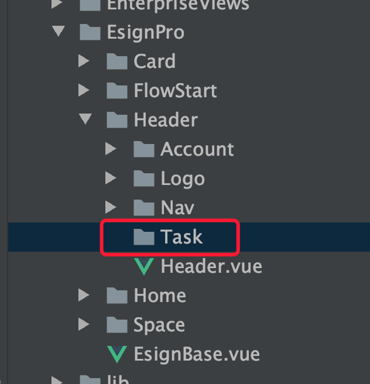

# 任务中心

任务中心技术方案

## 一、需求背景

### 1. 迭代名称

迭代名称

[wiki 地址](http://wiki.timevale.cn:8081/pages/viewpage.action?pageId=90505217)
[交互地址](https://lanhuapp.com/web/#/item/project/product?tid=2c76857e-e436-4b80-8c5d-57f01c1dcab4&teamId=2c76857e-e436-4b80-8c5d-57f01c1dcab4&pid=6dffe393-a4f4-4af2-968b-5f1775eebe19&project_id=6dffe393-a4f4-4af2-968b-5f1775eebe19&image_id=c423a77d-4a0d-4247-a9df-a967b7d35376&type=share_mark&param=8ec7b714-377f-41bf-adf2-82b14a68e9a1&docId=c423a77d-4a0d-4247-a9df-a967b7d35376&docType=axure&pageId=1782e96844c74c98b6191cd972a0fb1d)

### 2. 目标

目标是什么

## 二、难点调研（包含技术选型）

无

## 三、技术方案

### 1. 流程图

无

### 2. 接口/页面设计

#### Task 模块

header 添加 Account 中添加 task 模块，用来轮训查看任务状态。

轮训是全局的，每个页面都会存在，包括任务中心页面

目录结构：



::: tip 提醒
这个接口与 消息通知接口 类似，当登录态失效后，
不会重定向到登录页面，而是弹窗提醒用户。
:::

#### 任务中心 页面

跳转前，切换空间

```js
export default {
  methods: {
    // 设置空间
    async setSpace() {
      // 静默 切换空间 todo 这里 space 要从后端获取ID，然后到空间列表遍历获取详情

      const space = {}
      await this.$EventBus.$emit('SpaceHandleChange', {
        type: 'organ',
        space,
      })

      // 延时跳转
      setTimeout(() => {
        this.$router.push({ path: '/contract' })
      }, 30)
    },
  },
}
```

#### 合同发起-指定位置页面

子丘 需要添加个 loading，需要个字段告诉子丘 是否显示 loading


页面销毁前 清除轮训

```js
export default {
  beforeDestroy() {
    // 页面销毁前 清除轮训 loopTaskId 列表轮训ID
    clearInterval(this.loopTaskId)
  },
}
```


### 3. WebSocket 初探

[WbeSocket 文档](https://developer.mozilla.org/zh-CN/docs/Web/API/WebSocket)

[WebSocket 教程](https://www.ruanyifeng.com/blog/2017/05/websocket.html)

### 4. 前端组件
无

### 5. 兼容性

无

### 5. 性能问题

## 四、任务排期

排期表：xxxx
