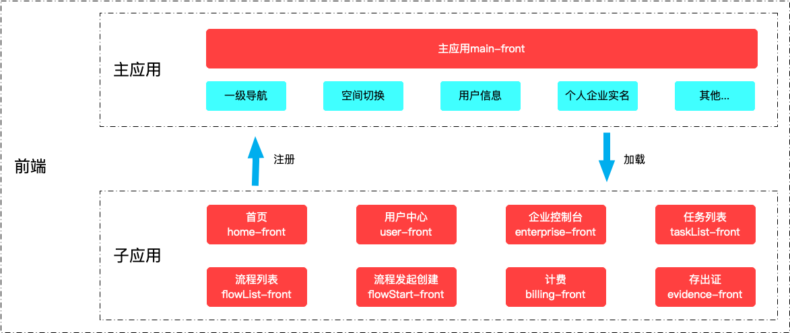
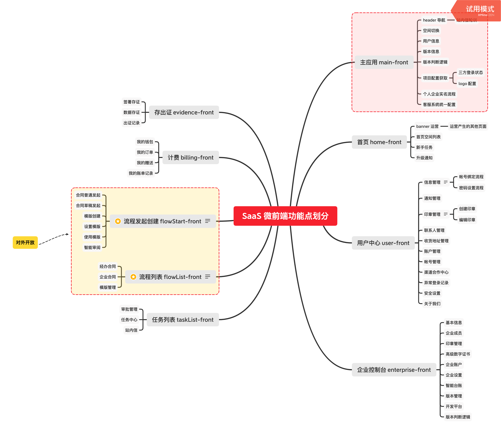

# 标准签微前端

## 需求背景

- 解决 Saas 页面
    - 体验不一致（页面 header 部分 UI 和交互不统一）
    - 操作效率低（标准签与计费和存证2个项目之间来回跳转）
    - 重复建设严重（客服功能、空间切换功能）
    - 三方业务对接成本高（钉签使用'经办合同、企业合同'，发起模块对外开放）

- 解决标准签 开发效率低、可持续维护差、多人协作成本高的问题

## 目标

建立体验良好、可持续维护的 saas 系统

## 微前端方案

将 Saas 页面 划分为一个前端主应用 和 8个子应用，每个应用独立部署。

如果需要部分应用可以独立访问。

## 应用划分

应用划分

## 应用功能

各个应用的业务功能

