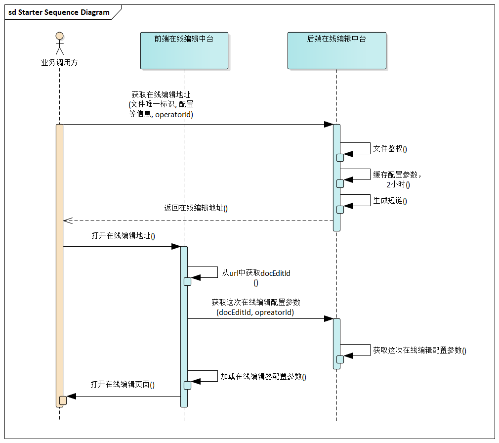
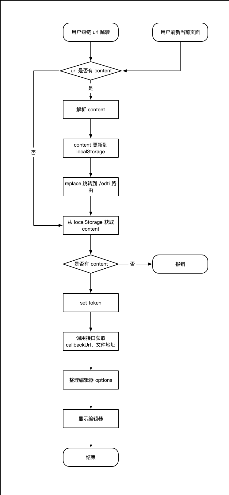

# 在线编辑中台

在线编辑中台

## 引入方式

### iframe 引入

```html
<script>
  // 获取编辑器地址 （示意）
  const editorURL = axios.get('v1/docedit/getUrl')
</script>

<iframe id="editorBox" :src="editorURL"></iframe>
```

### SDK 引入

todo

## 流程图

### 业务方时序图



### 编辑中台初始化流程图



## 编辑器配置 editorConfig

编辑器配置

### editorConfig.type

- **描述：** 设置平台类型

- **类型：** `string`

- **默认值:** `desktop` PC 端

- **可选值：**
  - `desktop` PC 端
  - `mobile` 手机端

### editorConfig.mode

- **描述：** 指定文档打开模式

- **类型：** `string`

- **默认值：** `edit` 编辑模式

- **可选值：**
  - `edit` 编辑模式
  - `view` 只读模式

### editorConfig.client

- **描述：** 运行在那个客户端，不同客户端回调的方法不同

- **类型：** `string`

- **默认值：** `web` 正常浏览器
  - `web` 正常浏览器（包括 pc 和移动端浏览器）
  - `wx-app` 微信小程序 （具体名字在确定）

### editorConfig.redirectUrl

- **描述：** 用户保存成功后的重定向地址，如果不想被重定向就不用传。新开 tab 场景使用

- **类型：** `string`

- **默认值：** `''` 空

### editorConfig.UICondig (次要)

- **描述：** 一些 UI 的配置（目前只有一个底部提交按钮），只支持 移动端

### editorConfig.UICondig.btnText

- **描述：** 底部按钮文案

- **类型：** `string`

### editorConfig.UICondig.btnStyle

- **描述：** 底部按钮样式

- **类型：** `Object`

## 编辑器通信方式

- **描述：** 回调的信息

- **类型：** `Object`

- **返回值：**

  - eventName （要不要 定义为 eventCode）

    - `180001（logoStatusExpired）` 登录失效

    - `180002（forceSave）` 手动保存

    - `180003（documentStateChange）` 文档修改时回调事件

  - data 事件数据

    - `data.fileKey` 文件唯一标识

* **结构：**

```js
{
  // 事件名称
  eventName: "forceSave";
  // 事件 code
  eventCode: 180001;
  // 事件数据
  data: {
  }
}
```

### 正常浏览器

```js
const hanndleMessage = (event) => {
  // 编辑器的 origin
  const editOrigin = "xxxxx";

  // 判断是否来自 编辑器 事件
  if (event.origin === editOrigin) {
    // ...
  }
};

if (typeof window.addEventListener !== "undefined") {
  window.addEventListener("message", hanndleMessage, false);
} else if (typeof window.attachEvent !== "undefined") {
  window.attachEvent("onmessage", hanndleMessage);
}
```

### 微信小程序

```html
<script src="//res.wx.qq.com/open/js/jweixin-1.3.2.js"></script>

<script>
  window.wx.miniProgram.postMessage({ eventCode: 180001, data: {} });
  window.wx.miniProgram.navigateBack();
</script>
```
